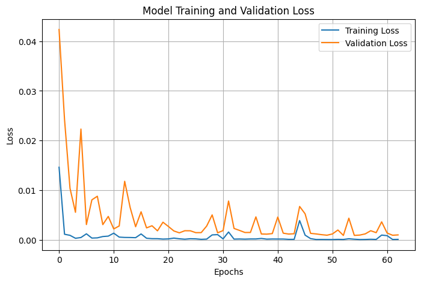
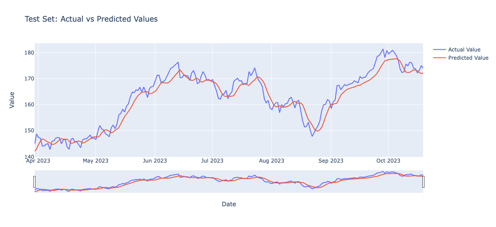

# AI & Finance: Launching Your Journey in LSTM Stock Predictions

## Overview
LSTM-StockPredictorXLY is a project that uses AI to forecast stock prices in the Consumer Discretionary sector. By analyzing 60 days of historical data, this tool aims to provide accurate predictions to aid investors and enthusiasts in making informed decisions.

## Features
- Data preprocessing for stock market analysis.
- LSTM neural network model for price prediction.
- Performance evaluation using RMSE and MAPE.
- Visual comparison of predicted vs. actual stock prices.

## Getting Started

### You'll Need
- Python 3.6 or newer
- TensorFlow 2.x
- Some other tools like Pandas, NumPy, and a few more for graphs

### Setup Steps
1. Download this project.
2. Install needed tools: `pip install -r requirements.txt`
3. Open the notebook: `jupyter notebook lstm-time-series-stock-prediction-workflow.ipynb`

## What We Found

### Training the Model
We taught our model to understand stock prices, and it got pretty good at it! We made sure it learned just enough without memorizing the data.

### How Well Does It Do?
We checked how close the model's guesses were to the real stock prices. It did a really good job, but remember, it's not perfect.

- Test RMSE: 2.881858075912953
- Test MAPE: 0.014588268594683193

### Seeing Is Believing
We made some graphs to show how the model's guesses compared to the actual stock prices. It's quite impressive!

## Thoughts on the Results
The lines show the actual stock prices versus what the model predicted they would be. The match is still quite good, but there are places where the model misses the mark more than in the train and validation sets. This could be because the test data may have patterns or changes the model hasn’t seen before.
The gaps in the test graph could be a sign that the model needs to learn from more examples or different kinds of data to predict these points better. But even with those gaps, the model seems to have a good handle on the overall direction of the stock prices.

## Looking Ahead
This project is just the beginning. There's so much more to explore with AI in finance. We could try using different kinds of data, tweaking the model, or testing out new methods to get even better results.

## Learn More
For a more detailed discussion of this project, including insights into the LSTM model and our approach to predicting stock prices, check out my Medium article: [AI & Finance: Launching Your Journey in LSTM Stock Predictions](https://medium.com/@bnhminh_38309/a-beginners-guide-to-predicting-stock-prices-with-lstm-networks-278070252731).
